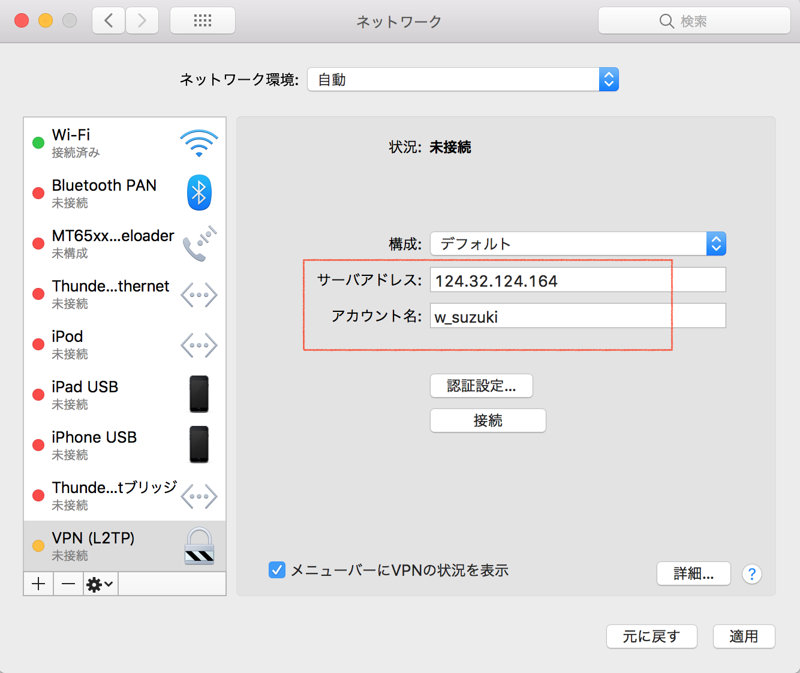
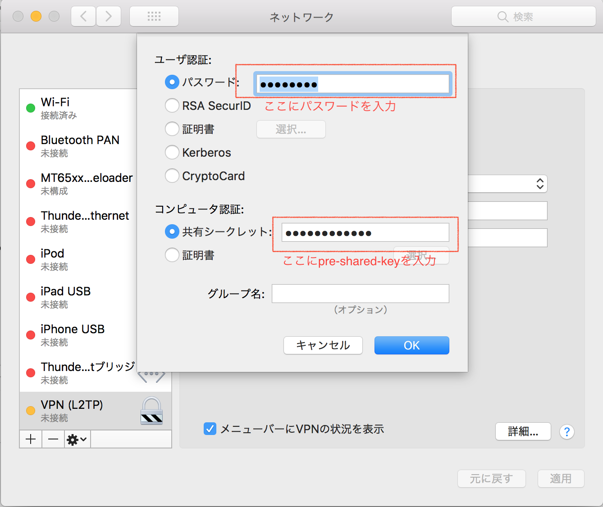
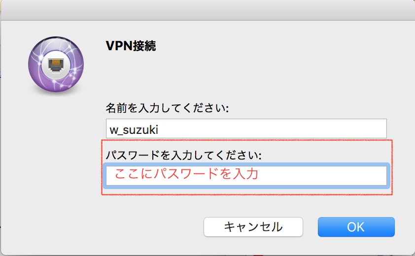
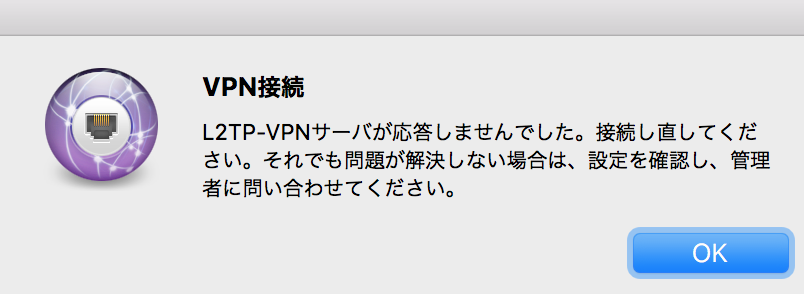

# リモートワークから使えること

現状では以下のことが行えます。
- [OpenSTF](#openstf)を利用した特定端末でのapk実行

## <a name="openstf">OpenSTFの利用方法</a>

### 事前に準備が必要なもの
- リモートからアクセスするVPNアカウント
  - 情シスから払い出してもらう必要があります
  - 依頼後、個別にGmailへアカウントの連絡が来るので、これを利用します。

### VPNセットアップ
以下の情報を参考にセットする。  
なお社内ネットワークからは接続できないので、もし社内で事前にテストしたい場合はテザリングなどで実施。
- [Windows向け](http://www.vpngate.net/ja/howto_l2tp.aspx#windows)
- [Mac向け](http://www.vpngate.net/ja/howto_l2tp.aspx#mac)

#### VPNセットアップ例




##### もし、こういう表示が出たら
情シスに問い合わせてください（アカウント情報に間違いがある可能性もあるので）


### OpenSTF起動方法
1. オフィス出社済みの方に使いたい端末をSlackで連絡して共有マシンに`adb`接続
2. 以下のコマンドで立ち上げる
  ```bash
  rethinkdb &
  stf local --public-ip <your_internal_network_ip_here>
  #現状だと「stf local --public-ip <1.1.1.100>」って感じになります。
  ```
3. 起動が済んだら、ブラウザから「 http://1.1.1.100:7100 」にアクセス
4. 特にユーザ管理はしていないので、適当な名前とメールアドレスを入力してログイン
5. 利用したいデバイスを選択

apkのアップロードなどはすぐにやり方わかると思います。
