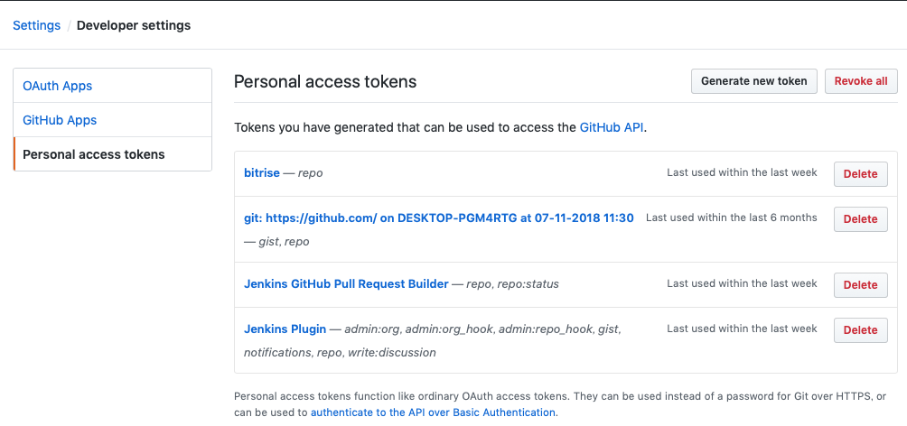

# Jenkinsの使い方

**注意：分からないことはググる！（ここに記載されている情報はググった上での試行錯誤の結果です）**

## インストール方法
macでは[Homebrew](https://brew.sh/index_ja)を使うのが楽っぽかったので、そちらで管理。  
定期的に`brew upgrade jenkins`でアップデートしてください（月一回程度）

## GitHubとの接続について
うちのJenkinsはローカルネットワーク上で動作していますので、GitHubからお話はできません。  
つまりWebHook APIによる連携は（現状では）行えません。

代わりに[GitHub pull request builder plugin](https://wiki.jenkins.io/display/JENKINS/GitHub+pull+request+builder+plugin)を使っています。

### GitHub pull request builder pluginとの連携

#### GitHub側で必要なこと
- Jenkins上から各リポジトリやPullRequestへのアクセスが可能な`Personal access token`を発行します。
  
  - 必要な権限はマネージャーとチェックの上で決定することをオススメします。
  - 当然ながら外部サービスのbitriseなどを使うときと条件は異なります。

#### Jenkins側で必要なこと
- `GitHub pull request builder plugin`をインストールする（まだインストールしていない場合）
  - 当然ながら現在はインストール済みです。
- Credencialを作成する
  - [参考：トークンの作成](http://qiita.com/naotawool/items/e7fef0b2de7f070d891d#トークンの生成)
  - ちゃんと動くか、[こんな感じ](https://qiita.com/naotawool/items/e7fef0b2de7f070d891d#test-credentials)でチェックする
- ↑が終わったらジョブが設定できます
  - [参考：ジョブの設定](https://qiita.com/naotawool/items/e7fef0b2de7f070d891d#ジョブの設定)

##### PullRequest用のジョブを作る際のtips
1. ターゲットのGitリポジトリを設定する際、`高度な設定`にてワイルドカードを設定すべし
  - `+refs/pull/*:refs/remotes/origin/pr/*`
2. `Trigger phrase`と`Skip phrase`のカスタマイズは必ず行うべし
