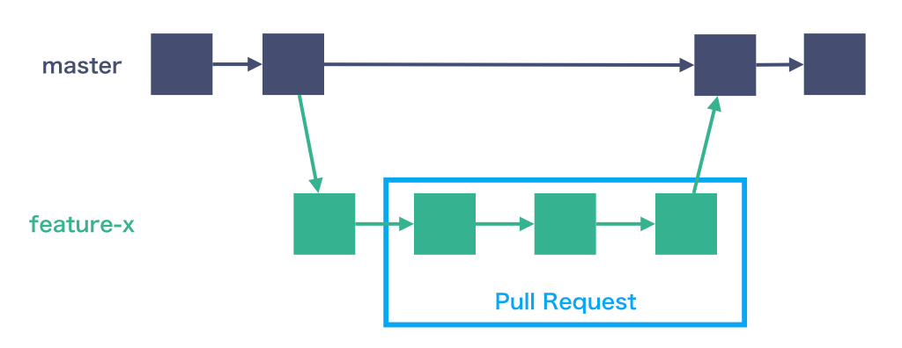
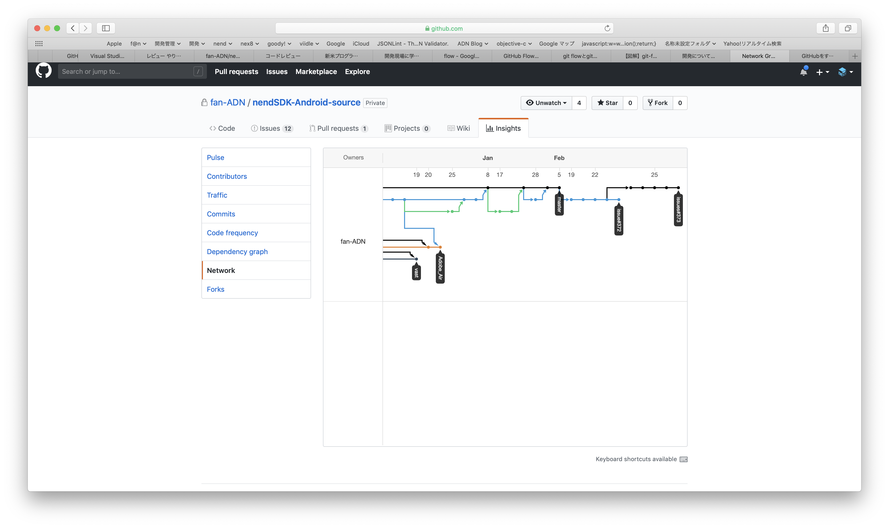
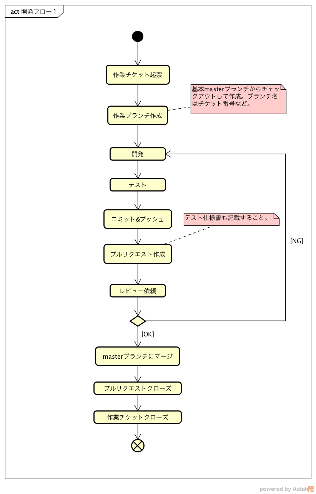
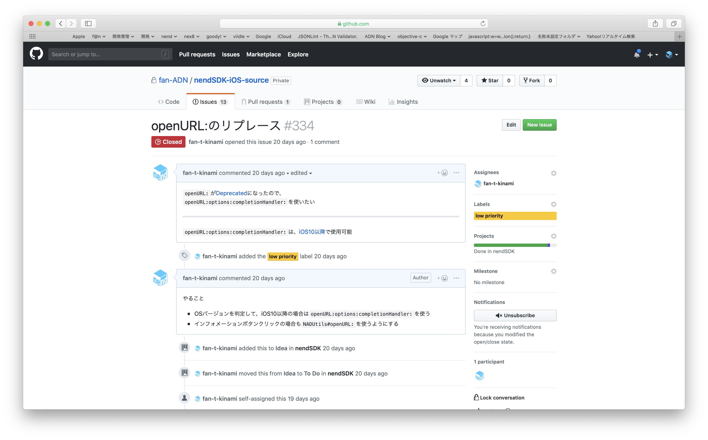
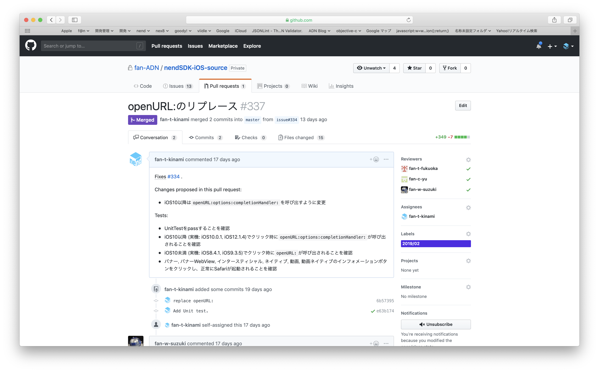
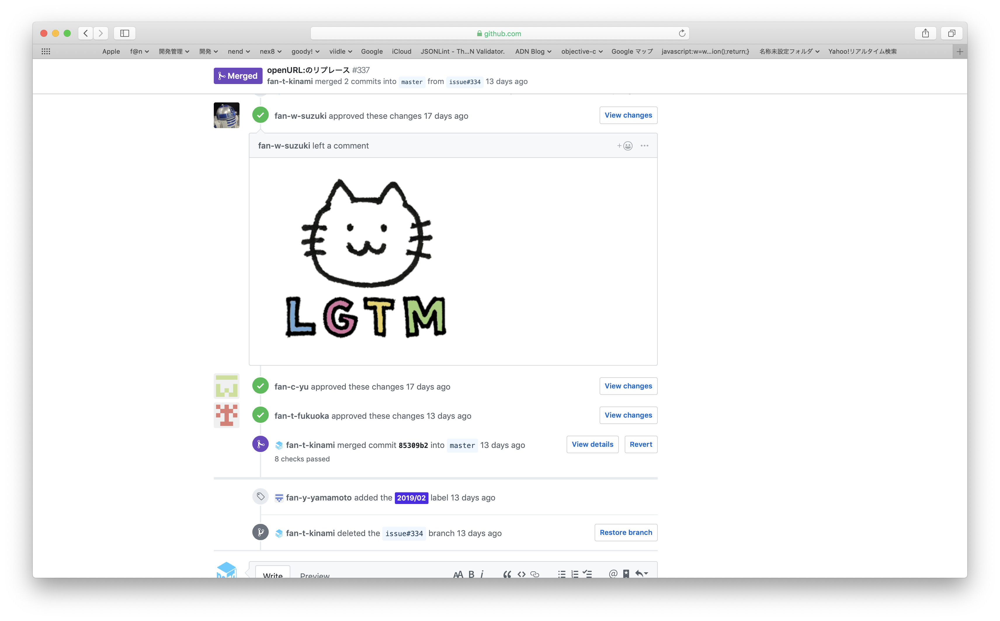

# GitHub Flowについて

サービス開発部では、GitHub Flowで開発を行なっている

## GitHub Flowとは

GitHubを利用したシンプルで強力なワークフローである

こっそり始めるGit／GitHub超入門  
https://www.atmarkit.co.jp/ait/articles/1708/01/news015.html

```
「GitHub Flow」は「GitHub」の開発で使用されているワークフローであり、「git-flow」に比べてシンプルな構成になっています。

　1日に複数回デプロイを行うようなWebアプリケーションの開発に適しています。
```

<!-- git-flowのイメージ -->
- git-flowのイメージ (git-flowについては詳細な説明はここでは行わない)


<!-- GitHub Flowのイメージ -->
- GitHub Flowのイメージ


<!-- GitHubのnetworkの図 -->
- GitHub上で見られるグラフデータ


### 6つのルール

GitHub Flowには以下の6つのルールがあります。【ルール1】が最も重要で、それ以外のルールは【ルール1】を実現するために存在します。

- 【ルール1】masterブランチは常にデプロイ可能である
- 【ルール2】作業用ブランチをmasterから作成する（例：new-oauth2-scopes）
- 【ルール3】作業用ブランチを定期的にプッシュする
- 【ルール4】プルリクエストを活用する
- 【ルール5】プルリクエストが承認されたらmasterへマージする
- 【ルール6】masterへのマージが完了したら直ちにデプロイを行う

## 開発３課での例

<!-- 開発フローの図 -->


### 作業チケット起票

GitHub上でissueを作成する
<!-- GitHubのissueのSS -->



### 作業ブランチ作成

ローカルにクローンしたリポジトリで作業ブランチを作成する  
開発３課では、`issue#` +  `issueの番号`でブランチを作成している
<!-- sourcetreeのTreeのSS -->


### 開発、コミット＆プッシュ
ローカル環境で開発を行います  
任意のタイミングでコミット＆プッシュする

### プルリクエスト作成
テストまで完了したらプルリクエストを作成しコードレビューを依頼する




### masterブランチにマージ、プルリクエストクローズ、作業チケットクローズ
レビューが完了したらmasterブランチにマージし、プルリクエストをクローズする  
作業チケット(issue)も自動的にクローズされる


